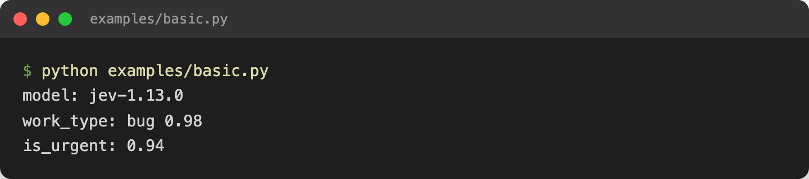
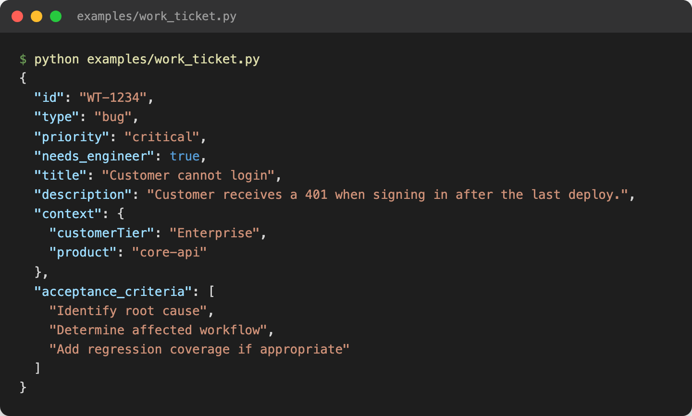

# langgraph-jev

`langgraph-jev` is an open-source LangGraph/LangChain integration for
[Jev](https://docs.typesafe.ai/introduction), TypeSafe's typed probabilistic
decision API. `JevNode` wraps it as a decision node you drop into an agent
graph -- it's not an LLM and not an LLM wrapper.

Jev evaluates typed *questions* against *state* and returns typed answers with
probabilities and confidence attached. There's no text generation and nothing
to parse -- your code branches on, sorts by, and routes with the result
directly.

For example, a `work_ticket` graph might run an "understand" step over a
customer request, hand the structured output to a `JevNode` for typed
decisions (work type, priority, whether it needs an engineer), and then route
to a coding, support, or docs worker based on those decisions. See
`examples/work_ticket.py` for the full version of this.

## Installation

```bash
pip install langgraph-jev
```

Set your API key (never commit it):

```bash
export TYPESAFE_API_KEY=...
```

The examples in `examples/` also support a project-local `.env` file (already
covered by `.gitignore`) via optional `python-dotenv` support:

```bash
pip install "langgraph-jev[examples]"
echo "TYPESAFE_API_KEY=..." > .env
python examples/basic.py
```

## Quick start

```python
from langgraph_jev import JevNode, choice

jev = JevNode(
    questions={
        "route": choice(["coding", "support", "research"]),
    }
)
```

Running `examples/basic.py` against a real state produces typed decisions
with confidence scores, not free text:



## Resource cleanup

`JevClient` (and anything built on it, like `JevNode`/`JevRunnable`) opens
underlying HTTP clients on construction. Close it when you're done, or use
it as a context manager:

```python
from langgraph_jev import JevClient, choice

with JevClient() as client:
    result = client.decide(state={"title": "..."}, questions={"route": choice(["a", "b"])})

# or, in async code:
async with JevClient() as client:
    result = await client.adecide(state={"title": "..."}, questions={"route": choice(["a", "b"])})
```

If you construct a long-lived `JevNode`/`JevRunnable` (e.g. one per graph,
reused across requests), there's no need to close it per-call -- call
`client.close()`/`await client.aclose()` once when your application shuts
down.

## LangGraph

`JevNode` is directly callable by LangGraph -- it receives graph state and
returns a state update (not a replacement of the whole state):

```python
graph.add_node("jev", jev)
```

By default the entire graph state is passed to Jev as `state`. Use
`state_key`/`output_key` to scope input and output:

```python
jev = JevNode(
    state_key="structured_request",
    output_key="decision",
    questions={...},
)
```

## Confidence routing

Choice and Score answers include a `confidence` score derived from the
response's probability distribution (see
[Confidence](https://docs.typesafe.ai/confidence)). Configure thresholds and
a policy for what happens below them:

```python
jev = JevNode(
    questions={
        "work_type": choice(["bug", "support", "configuration", "documentation"]),
        "priority": choice(["critical", "high", "normal", "low"]),
    },
    thresholds={"work_type": 0.85, "priority": 0.90},
    low_confidence="human_review",  # "allow" (default) | "human_review" | "error"
)


def route_after_jev(state):
    if state["decision"].requires_review:
        return "human_review"
    return "continue"
```

Low-confidence decisions are never silently discarded -- the full decision
and its confidence are always available on the result.

## Routing helper

```python
from langgraph_jev import route_by_decision


def route_work(state):
    return route_by_decision(
        state["decision"],
        field="work_type",
        routes={
            "bug": "coding_agent",
            "support": "support_agent",
            "documentation": "documentation_agent",
        },
        fallback="human_review",
    )
```

Jev makes the probabilistic decision; your application code decides what to
do with it. Routing stays deterministic.

## WorkTicket example

Jev doesn't generate the `WorkTicket` itself -- it provides the decisions,
and your application code builds the typed contract from them:

```python
decision = state["decision"]

ticket = WorkTicket(
    id="WT-1234",
    type=decision["work_type"].value,
    priority=decision["priority"].value,
    needs_engineer=decision["needs_engineer"].value,
    title=request["title"],
    description=request["description"],
    context={"customerTier": request.get("customerTier")},
    acceptance_criteria=["Identify root cause", "Add regression coverage if appropriate"],
)
```



See `examples/work_ticket.py` for the full example: an understand step feeds
Jev, Jev's decisions build a `WorkTicket`, and the ticket routes to a coding,
support, or docs worker.

## LangChain Runnable

```python
from langgraph_jev import JevRunnable, choice

jev = JevRunnable(questions={"route": choice(["coding", "support", "research"])})
result = jev.invoke({"title": "Customer cannot login"})
```

Supports both `invoke()` and `ainvoke()`.

## Examples

| File | Demonstrates |
| --- | --- |
| `examples/basic.py` | Minimal `JevClient` usage |
| `examples/langgraph_basic.py` | A minimal LangGraph graph with a `JevNode` |
| `examples/confidence_routing.py` | Thresholds and `low_confidence="human_review"` |
| `examples/work_ticket.py` | Building a `WorkTicket` from Jev's decisions |
| `examples/multi_agent.py` | Full graph: understand -> Jev -> ticket -> routed workers |

## Public API

```python
from langgraph_jev import (
    JevClient,
    JevNode,
    JevRunnable,
    choice,
    boolean,
    score,
    route_by_decision,
)
```

That's the full public API. Errors (`JevError` and its subclasses
`JevConfigurationError`, `JevAPIError`, `JevTimeoutError`,
`JevValidationError`) and the result types (`JevDecision`, `JevResult`) are
also exported for type annotations and `except` clauses.

## Development

```bash
pip install -e ".[dev]"
pytest
ruff check .
ruff format .
mypy src
```

Tests use a fake/mock Jev transport and never require a real
`TYPESAFE_API_KEY`. CI runs `ruff check`, `ruff format --check`, `mypy`, and
`pytest` on Python 3.11-3.13.

## License

MIT
